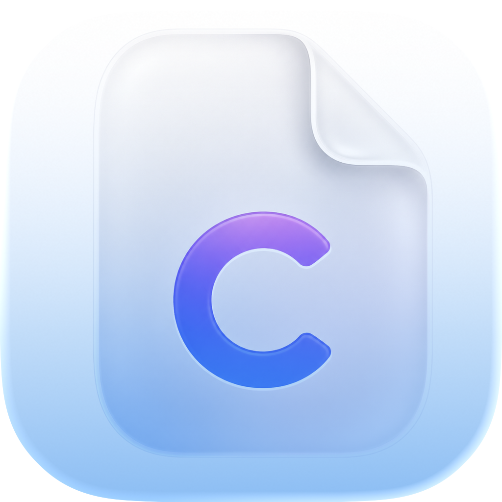
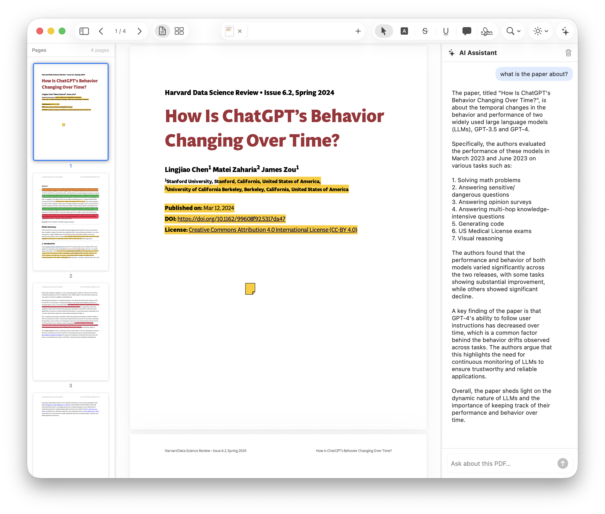
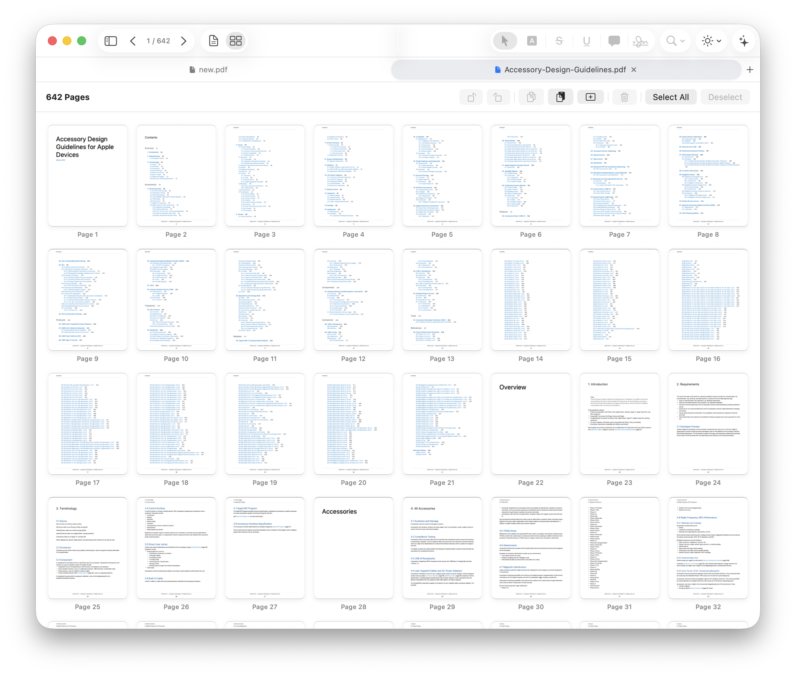
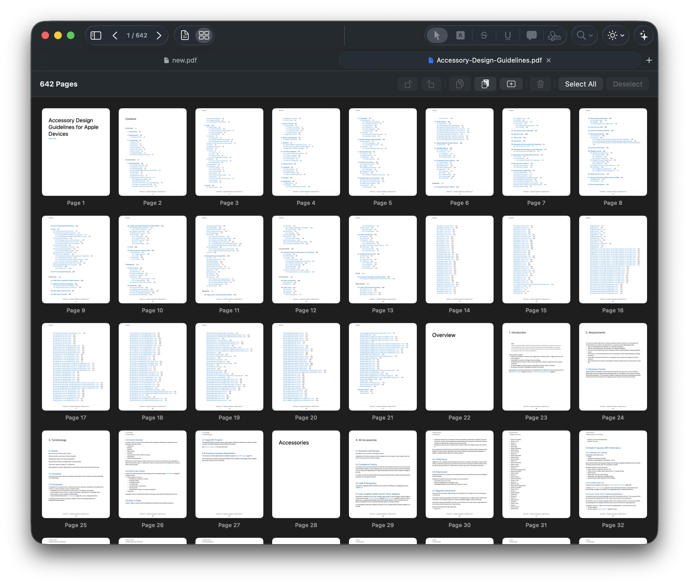

# Folio

<p align="center">
  
</p>

<p align="center">
  A native macOS PDF editor built with SwiftUI, PDFKit, CoreGraphics, CoreText, and the Swift Observation framework.<br>
  Designed to feel at home on macOS 26 with a Liquid Glass toolbar aesthetic.
</p>

---

## Screenshots

<p align="center">
  
  <br><em>Scroll view with thumbnail sidebar, annotation tools, and resizable AI sidebar</em>
</p>

<p align="center">
  
  <br><em>Page organizer grid in light mode</em>
</p>

<p align="center">
  
  <br><em>Page organizer grid in dark mode — 642-page document</em>
</p>

---

## Features

### Document Management
- Open multiple PDFs in a **Safari-style tab bar** — embed tabs inside the toolbar or show a dedicated strip below it (configurable in Settings → General)
- Open via ⌘O, drag-and-drop onto the welcome screen, or **New Empty Document** (⌘N)
- **Welcome screen** with drag-and-drop drop zone and a **Recent Files** list (bottom half)
- Per-tab unsaved-changes indicator (blue dot on the tab thumbnail) and a Save / Don't Save / Cancel alert on close
- **Non-blocking background save** — PDF serialisation and disk write both run off the main thread; ⌘S returns instantly with a spinner badge on the tab

### PDF Viewer
- **Scroll view** (continuous) and **Page Grid** organizer, switchable with ⌘⇧1 / ⌘⇧2 or the segmented picker in the toolbar
- Pinch-to-zoom and keyboard zoom (⌘= / ⌘−) with a live percentage readout in the toolbar zoom menu
- **Reading modes** — Default · Night · Sepia, selectable from the toolbar dropdown
- Text selection with instant annotation application on mouse-up

### Annotation & Editing Tools

| Tool | Shortcut | Description |
|------|----------|-------------|
| Select | E | Move and resize existing PDFKit annotations via native drag handles |
| Markup | M | Grouped picker for highlight, underline, and strikethrough — switch sub-tool in the context palette |
| Comment | C | Click anywhere to place a speech-bubble (freeText) annotation |
| Text Box | T | Click to insert a resizable, styled text box; configure font, size, and colour in the context palette |
| **Edit Text** | — | Click any line of native PDF text to edit it inline; single-line or paragraph-aware; opens the Content Editor panel automatically |
| Shape | S | Draw rectangle, ellipse, or line overlay annotations; configurable stroke/fill from the palette |
| Stamp | — | Click to place a text stamp (APPROVED, DRAFT, CONFIDENTIAL, etc.) chosen from the context palette |
| Signature | G | Draw a freehand signature on a canvas; committed as a resizable PDFKit annotation |
| Audio Note | — | Embed a voice-recording annotation (microphone) |

- **Context-sensitive annotation palette** — a pill-shaped, `ultraThinMaterial` floating bar appears at the bottom of the canvas whenever an annotation tool is active, showing colour swatches, opacity sliders, font/size pickers, or stamp choices relevant to the active tool
- Highlight · underline · strikethrough colours and opacity are also configurable globally in **Settings → Annotations**
- Choose which tools appear in the toolbar segmented picker in **Settings → Tools** (with keyboard shortcut badges)

### Inline Text Editing & Content Editor
- Activating the **Edit Text** tool and clicking a PDF text line opens an `NSTextField` overlay positioned exactly over the original text — fonts, size, and colour are matched automatically
- Supports single-line replacement and multi-line paragraph reflow via CoreText (`CTFramesetterCreateWithAttributedString` + `CTFrameDraw`)
- The **Content Editor panel** slides in on the right whenever Edit Text is active; it lists all text lines on the current page, lets you select and bulk-edit them, and shows a progress/success indicator after each write
- All text mutations use a bare `CGContext` PDF round-trip — no third-party libraries, fully App Store compliant

### Page Organizer (Grid View)
- Full-document thumbnail grid with page numbers
- **Drag-to-reorder** via the native `Transferable` + `.draggable` / `.dropDestination` API
- Per-page actions: rotate left / right, delete, duplicate
- **Copy** (⌘C) and **Paste** (⌘V) pages across documents or within the same document
- Add a blank page, multi-select with ⌘-click, Select All (⌘A), Deselect

### Thumbnail Sidebar
- **Preview.app-style** single-column layout — thumbnail image on top, page number below
- Thumbnails fill the available width and render at @2x for Retina displays
- **Draggable resize handle** — drag the divider to adjust sidebar width (120–244 pt)
- Four sections switchable via an icon picker: **Thumbnails · Outline · Bookmarks · Annotations list**
- Toggle with ⌘⇧S

### Document Intelligence
- **OCR** — run Vision `VNRecognizeTextRequest` (accurate mode, language correction) on any page to extract text from scanned documents
- **Scan enhancement** — CoreImage filter pipeline to improve contrast and readability of scanned pages
- **Summarisation hook** — pipe extracted text to the configured AI provider for a one-tap page or document summary

### Forms & Signatures
- **AcroForm detection** — automatically discovers PDF widget annotations (text fields, checkboxes, radio buttons) via `PDFAnnotationSubtype.widget`
- Fill interactive form fields directly; changes are committed back to the PDF on save
- **Signature canvas** — draw with pressure-sensitive strokes; confirm to embed as a scalable PDFKit annotation

### AI Assistant Sidebar
- Toggle with the ✦ sparkles button in the toolbar
- Resizable right-hand panel (drag the handle to adjust width)
- Ask any question about the open document; the current page's text is automatically included as context (capped at 12 000 characters)
- Supports **OpenAI** (GPT-4o, GPT-4-turbo, GPT-3.5-turbo), **Claude / Anthropic** (claude-opus-4, claude-sonnet-4, claude-haiku-3), and **Groq** (llama-3.3-70b, llama-3.1-8b, gemma2-9b, mixtral-8x7b)
- Streaming-style chat history with user/assistant bubbles, animated typing indicator, and one-tap conversation clear
- Configure provider, model, and API keys in **Settings → AI**
- API keys stored exclusively in the **macOS Keychain** (`kSecClassGenericPassword`, `kSecAttrAccessibleWhenUnlockedThisDeviceOnly`) — never in UserDefaults or logs

### Settings (⌘,)

| Pane | Options |
|------|---------|
| **General → Theme** | System / Light / Dark appearance |
| **General → Tab Style** | In Toolbar (tab pills in title bar) · Tab Bar (dedicated strip below toolbar) |
| **General → On Launch** | Restore open documents, default reading mode, show sidebar by default |
| **Display** | Default view mode (Scroll / Grid), default zoom level (25%–400%) |
| **Annotations** | Default highlight / underline / strikethrough colour and highlight opacity |
| **Tools** | Toggle which annotation tools are visible in the toolbar segmented picker |
| **AI** | Provider picker, model picker, per-provider API key management |

### Toolbar Layout

```
[Sidebar] [◀ N/total ▶] [Scroll|Grid]  ·  [─── Tab strip ───]  ·  [Tools] [Zoom▾] [Mode▾] [✦]
```

- **Left zone**: sidebar toggle (⌘⇧S), page navigation with live page count, scroll/grid view picker
- **Centre zone** (In Toolbar mode): scrollable tab strip with thumbnail previews, close buttons, unsaved-changes dots, and a `+` new-tab menu
- **Right zone**: annotation tool segmented picker, zoom menu (shows current %), reading mode menu, AI sparkles toggle
- All right-side items collapse gracefully into a `>>` overflow menu with proper labelled submenus on smaller windows

### Keyboard Shortcuts

| Action | Shortcut |
|--------|----------|
| Open PDF | ⌘O |
| New Empty Document | ⌘N |
| New Tab | ⌘T |
| Save | ⌘S |
| Close Tab | ⌘W |
| Toggle Sidebar | ⌘⇧S |
| Scroll View | ⌘⇧1 |
| Page Grid | ⌘⇧2 |
| Zoom In / Out / Fit | ⌘= / ⌘− / ⌘0 |
| Select tool | E |
| Markup (highlight / underline / strikethrough) | M |
| Comment | C |
| Text Box | T |
| Shape | S |
| Signature | G |
| Settings | ⌘, |

---

## Requirements

- **macOS 26** or later
- **Xcode 26** or later

---

## Architecture

```
Folio/
├── FolioApp.swift                # @main — WindowGroup, Settings scene, menu commands
├── ContentView.swift             # Root layout: resizable sidebars, toolbar, file importer,
│                                 #   auto-open Content Editor on editText tool activation
├── Folio.entitlements            # App Sandbox + network.client + user-selected files
├── Models/
│   ├── AppState.swift            # @Observable singleton — tabs, active tool, sidebar flags
│   ├── DocumentTab.swift         # Per-document state; non-blocking background save
│   ├── ActiveTool.swift          # Annotation tool enum with symbol names & shortcut metadata
│   ├── AIProvider.swift          # AI provider enum + Keychain API key store
│   ├── ReadingMode.swift         # Default / Night / Sepia
│   └── ViewMode.swift            # Scroll / Grid
├── Services/
│   ├── AIService.swift           # @Observable — OpenAI / Anthropic / Groq HTTPS streaming
│   └── CorePDFEngine.swift       # App Store–safe PDF mutation engine (CoreGraphics + CoreText)
│                                 #   • Image insertion via CGContext
│                                 #   • Text replacement via CTFramesetter / CTLineDraw
│                                 #   • Text extraction via PDFPage + line grouping
├── Modules/
│   ├── PDFViewerCore/            # NSViewRepresentable PDFView bridge + inline text editor overlay
│   │   ├── PDFKitView.swift      #   NSEvent monitors, annotation hit-testing, editText click handling
│   │   ├── PDFViewerView.swift   #   SwiftUI wrapper — annotation palette, inline editor state
│   │   ├── PDFViewerViewModel.swift # Zoom, display mode, page binding
│   │   ├── PDFTabContainer.swift #   DocumentTabBar (toolbar pills) + TabBarRowView (bar strip)
│   │   ├── InlineTextEditorOverlay.swift # NSTextField positioned over the clicked text line
│   │   └── AnnotationResizeOverlay.swift # Selection handles for resizable annotations
│   ├── AnnotationManager/        # Annotation VM + pill-shaped context palette
│   ├── ContentEditor/            # Right-panel bulk text/image editor via CorePDFEngine
│   ├── DocumentIntelligence/     # OCR (Vision), scan enhancement (CoreImage), summarisation
│   ├── PageOrganizer/            # Grid reorder view + VM (copy/paste/add/rotate/delete)
│   └── FormsAndSignatures/       # AcroForm field detection + signature canvas
├── Views/
│   ├── Sidebar/                  # ThumbnailSidebarView, OutlineView, BookmarksView, AnnotationsListView
│   ├── AISidebar/                # AIChatSidebarView, chat bubbles, typing indicator
│   ├── Toolbar/                  # MainToolbarView, FloatingToolbarView
│   └── Welcome/                  # Drop zone + Recent Files empty-state screen
└── Settings/
    ├── SettingsStore.swift        # @Observable UserDefaults-backed preferences
    ├── SettingsView.swift         # TabView shell with icon strip sidebar
    └── Panes/                     # General · Display · Annotations · Tools · AI
```

**Key patterns:**
- `@Observable` + `@MainActor` throughout — no `ObservableObject` or `Combine`
- `NSViewRepresentable` bridge to `PDFKit.PDFView` with `NSEvent` local monitors for annotation and inline-edit clicks
- Inline text editing: `PDFPage.selectionForLine` / `NSString.paragraphRange` for structure-aware hit detection; `NSTextField` overlay positioned in SwiftUI coordinates via GeometryReader
- PDF mutation via bare `CGContext` PDF output — `CTFramesetterCreateWithAttributedString` + `CTFrameDraw` for paragraph reflow, `CTLineDraw` for single-line replacement; no AppKit graphics context required
- `Transferable` + `.draggable` / `.dropDestination` for page reorder in the grid
- Security-scoped resource bookmarks held open for the lifetime of each tab
- `Task.detached(priority: .userInitiated)` for non-blocking PDF serialisation and disk write
- API keys in `kSecClassGenericPassword` Keychain items, `kSecAttrAccessibleWhenUnlockedThisDeviceOnly`
- **No AGPL dependencies** — MuPDF fully replaced by CoreGraphics + CoreText + PDFKit; App Store compliant

---

## Getting Started

1. Clone the repo
2. Open `Folio.xcodeproj` in Xcode 26+
3. Select your development team in **Signing & Capabilities**
4. Run on macOS 26 (⌘R)

---

## License

MIT License — see [LICENSE](LICENSE) for details.


## Features

### Document Management
- Open multiple PDFs in a **Safari-style tab bar** (embedded in toolbar or as a dedicated strip)
- Open via ⌘O, drag-and-drop, or **New Empty Document** (⌘N)
- Per-tab unsaved-changes indicator (blue dot) and Save / Don't Save / Cancel alert on close
- **Non-blocking background save** — PDF serialisation and disk write both run off the main thread; ⌘S returns instantly

### PDF Viewer
- **Scroll view** (continuous) and **Page Grid** organizer (⌘⇧1 / ⌘⇧2)
- Pinch-to-zoom and keyboard zoom (⌘= / ⌘−) with live percentage readout
- **Reading modes** — Default · Night · Sepia (toolbar dropdown)
- Text selection with instant annotation application

### Annotation & Editing Tools
| Tool | Shortcut | Description |
|------|----------|-------------|
| Select | E | Move/resize existing annotations |
| Markup | M | Grouped picker for highlight, underline, and strikethrough |
| Comment | C | Click to place a speech-bubble annotation |
| Text Box | T | Click to insert an editable, resizable text box |
| **Edit Text** | — | Click any PDF text to edit it inline — single lines or full paragraphs |
| Shape | S | Draw rectangle, ellipse, or line overlay annotations |
| Stamp | — | Click to place a text stamp (APPROVED, DRAFT, etc.) from the palette |
| Signature | G | Draw a freehand signature; resizable via PDFKit handles |
| Audio Note | — | Embed a voice-recording annotation |

- Highlight · underline · strikethrough colours and opacity configurable in **Settings → Annotations**
- Choose which tools are visible in the toolbar in **Settings → Tools**

### Page Organizer (Grid View)
- Full-document grid with page thumbnails and page numbers
- Drag-to-reorder via native Transferable API
- Rotate left / right, delete, copy pages (⌘C), paste pages (⌘V), add empty page
- Multi-select with ⌘-click · Select All (⌘A) · Deselect

### Thumbnail Sidebar
- **Preview.app-style** single-column layout — thumbnail image on top, page number centred below
- Thumbnails fill the available width and render at @2x for Retina
- **Draggable resize handle** — drag the divider to make the sidebar wider or narrower (120–244 pt)
- Sections: Thumbnails · Outline · Bookmarks · Annotations list
- Toggle with ⌘⇧S

### AI Assistant Sidebar
- **Sparkles (✦) toolbar button** — toggles a resizable right sidebar
- Ask any question about the open document; the PDF's text is automatically included as context (capped at 12 000 chars)
- Supports **OpenAI**, **Claude (Anthropic)**, and **Groq** (llama-3.3-70b, llama-3.1-8b, gemma2-9b, mixtral-8x7b)
- Chat history with user/assistant bubbles, animated typing indicator, and one-tap clear
- Configure provider, model, and API keys in **Settings → AI**
- API keys stored exclusively in the **macOS Keychain** — never in UserDefaults or logs

### Settings (⌘,)
| Pane | Options |
|------|---------|
| **General** | Appearance (System / Light / Dark), default reading mode, sidebar visibility on launch, restore documents on launch, tab bar style (In Toolbar / Tab Bar) |
| **Display** | Default zoom level, default view mode |
| **Annotations** | Highlight · underline · strikethrough colours and opacity |
| **Tools** | Choose which annotation tools are visible in the toolbar (with keyboard shortcut badges) |
| **AI** | Provider picker, model picker, API key management (OpenAI · Claude · Groq) |

### Toolbar
- **Left**: sidebar toggle, page navigation (◀ N/total ▶), scroll/grid picker
- **Centre**: tab strip (In Toolbar mode)
- **Right**: annotation tool picker → zoom menu → reading mode menu → AI sparkles button
- All right-side items collapse gracefully into a `>>` overflow menu with proper submenus

### Keyboard Shortcuts
| Action | Shortcut |
|--------|----------|
| Open PDF | ⌘O |
| New Empty Document | ⌘N |
| New Tab | ⌘T |
| Save | ⌘S |
| Close Tab | ⌘W |
| Toggle Sidebar | ⌘⇧S |
| Scroll View | ⌘⇧1 |
| Page Grid | ⌘⇧2 |
| Zoom In / Out / Actual | ⌘= / ⌘− / ⌘0 |
| Select tool | E |
| Markup (highlight / underline / strikethrough) | M |
| Comment | C |
| Text Box | T |
| Edit Text | — |
| Shape | S |
| Signature | G |
| Settings | ⌘, |

---

## Requirements

- **macOS 26** or later
- **Xcode 26.4** or later

---

## Architecture

```
Folio/
├── FolioApp.swift                # @main — WindowGroup, Settings scene, menu commands
├── ContentView.swift             # Root layout, resizable sidebars, toolbar, file importer
├── Folio.entitlements            # App Sandbox + network.client + user-selected files
├── Models/
│   ├── AppState.swift            # @Observable singleton — tabs, active tool, sidebar flags
│   ├── DocumentTab.swift         # Per-document state; non-blocking background save
│   ├── ActiveTool.swift          # Annotation tool enum with keyboard shortcut metadata
│   ├── AIProvider.swift          # AI provider enum + Keychain API key store
│   ├── ReadingMode.swift         # Default / Night / Sepia
│   └── ViewMode.swift            # Scroll / Grid
├── Services/
│   ├── AIService.swift           # @Observable — OpenAI / Anthropic / Groq HTTPS calls
│   └── CorePDFEngine.swift       # App Store–safe PDF mutation engine (no third-party libs)
│                                 #   • Image insertion via CGContext
│                                 #   • Text replacement via CTFramesetter / CTLineDraw
│                                 #   • Text extraction via PDFPage.characterBounds + line grouping
├── Modules/
│   ├── PDFViewerCore/            # NSViewRepresentable PDFView bridge, inline text editor overlay
│   ├── AnnotationManager/        # Annotation VM + floating colour/opacity palette
│   ├── ContentEditor/            # Sidebar panel for bulk text/image editing via CorePDFEngine
│   ├── DocumentIntelligence/     # OCR (Vision), scan enhancement (CoreImage), summarisation
│   ├── PageOrganizer/            # Grid reorder view + VM (copy/paste/add-empty/rotate/delete)
│   └── FormsAndSignatures/       # Signature canvas + PDFKit freeText annotation commit
├── Views/
│   ├── Sidebar/                  # ThumbnailSidebarView, ThumbnailCardView, OutlineView, etc.
│   ├── AISidebar/                # AIChatSidebarView, chat bubbles, typing indicator
│   ├── Toolbar/                  # Tab bar row, tab item views
│   └── Welcome/                  # Empty-state welcome screen
└── Settings/
    ├── SettingsStore.swift        # @Observable UserDefaults-backed preferences
    ├── SettingsView.swift         # TabView shell with icon strip
    └── Panes/                     # General · Display · Annotations · Tools · AI
```

**Key patterns:**
- `@Observable` + `@MainActor` throughout — no `ObservableObject` or `Combine`
- `NSViewRepresentable` bridge to `PDFKit.PDFView` with `NSEvent` local monitors for annotation + editing clicks
- Inline text editing: `PDFPage.selectionForLine` / `NSString.paragraphRange` for structure-aware hit detection; `NSTextField` overlay positioned in SwiftUI coordinates
- PDF mutation via bare `CGContext` PDF output — `CTFramesetterCreateWithAttributedString` + `CTFrameDraw` for paragraph reflow, `CTLineDraw` for single-line replacement; no AppKit graphics context required
- `Transferable` + `.draggable` / `.dropDestination` for page reorder
- Security-scoped resource bookmarks held open for the lifetime of each tab
- `Task.detached(priority: .userInitiated)` for non-blocking PDF serialisation and disk write
- API keys in `kSecClassGenericPassword` Keychain items, `kSecAttrAccessibleWhenUnlockedThisDeviceOnly`
- **No AGPL dependencies** — MuPDF fully replaced by CoreGraphics + CoreText + PDFKit; App Store compliant

---

## Getting Started

1. Clone the repo
2. Open `Folio.xcodeproj` in Xcode 26.4+
3. Select your development team in **Signing & Capabilities**
4. Run on macOS 26 (⌘R)

---

## License

MIT License — see [LICENSE](LICENSE) for details.
